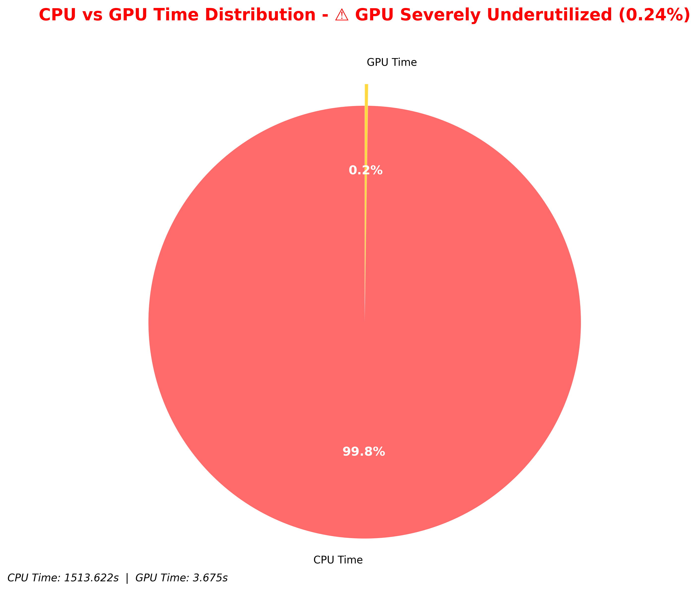
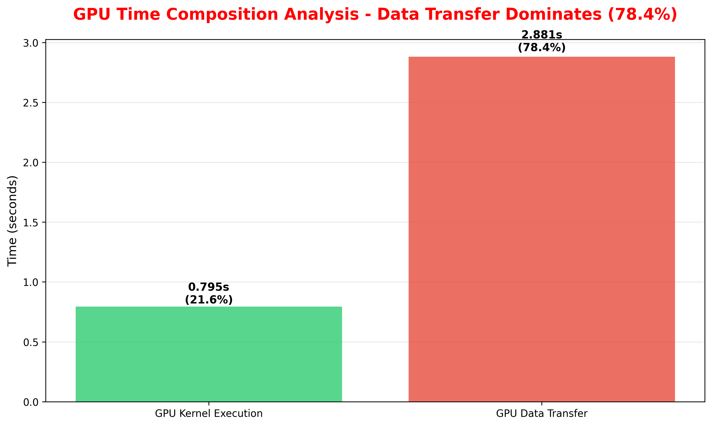
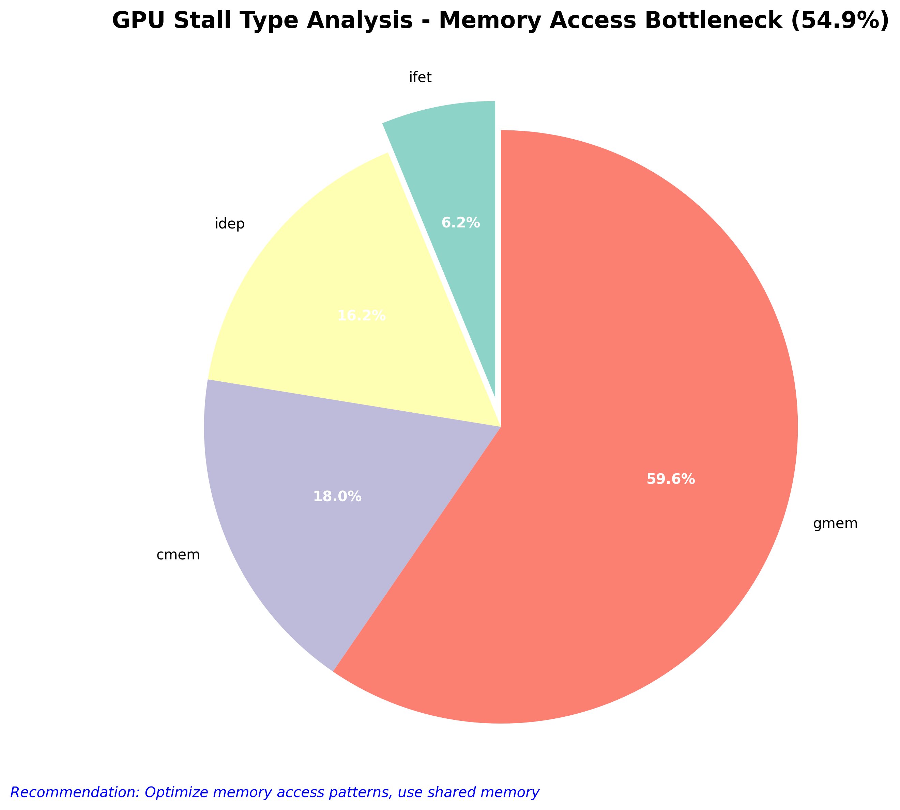
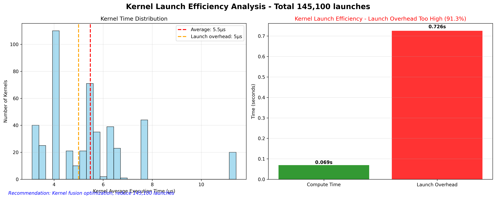
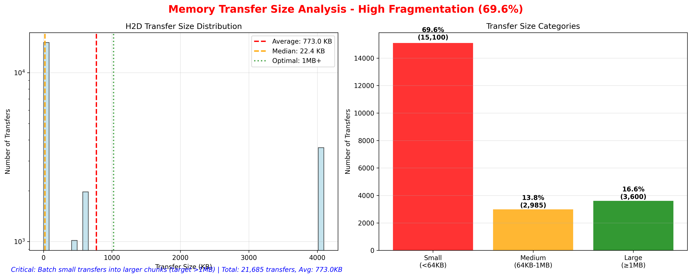
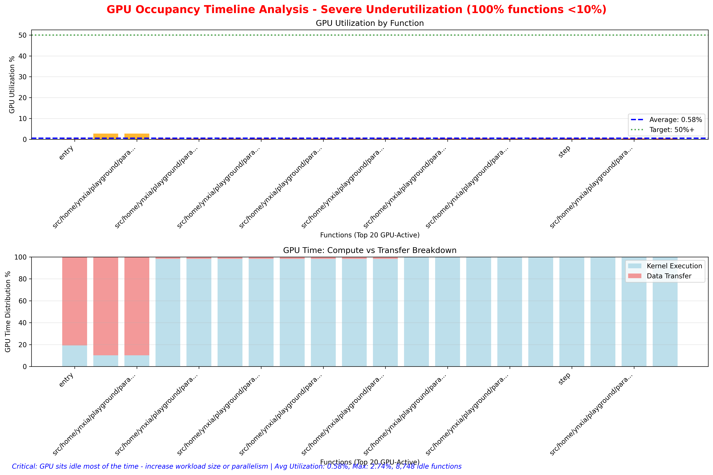

# DLRM GPU Performance Analysis Report

## Executive Summary

This report presents a comprehensive analysis of DLRM (Deep Learning Recommendation Model) GPU performance using HPCToolkit profiling data. The analysis reveals **critical performance issues** with extremely low GPU utilization (0.24%) and data transfer dominating GPU operations (78.4% of GPU time).

## Key Performance Findings

- **GPU Utilization**: 0.24% (99.76% idle time) - **Critical Issue**
- **Data Transfer Dominance**: 78.4% of GPU time spent on transfers vs 21.6% on compute
- **Memory Bandwidth**: 5,958 MB/s (9.31% PCIe efficiency) - **Severely Underutilized**
- **Kernel Launch Overhead**: 145,100 launches with 5μs average kernel time - **Excessive Fragmentation**
- **Transfer Volume**: 17.2 GB H2D transfers with 678.9 KB average size - **Sub-optimal**

---

## Performance Analysis Charts

### 1. CPU vs GPU Time Distribution

**Critical Finding**: GPU utilization at 0.24% indicates severe hardware underutilization.

**Analysis**:
- Total CPU time: 1,513.6 time units
- Total GPU time: 3.7 time units  
- **GPU utilization is 400x lower than CPU usage**
- This represents a massive waste of GPU hardware resources

**Business Impact**:
- Poor return on GPU hardware investment
- Workload is essentially CPU-bound despite GPU availability
- Immediate optimization required to justify GPU costs

### 2. GPU Time Composition Analysis

**Critical Finding**: Data transfer time (2.88s) is 3.6x larger than compute time (0.8s).

**Analysis**:
- GPU Kernel Time: 0.8s (21.6% of GPU time)
- GPU Copy Time: 2.9s (78.4% of GPU time)
- **Data movement completely dominates computation**

**Performance Impact**:
- GPU spends most time waiting for data rather than computing
- Memory bandwidth becomes the primary bottleneck
- Compute units are severely underutilized

### 3. GPU Stall Analysis

**Critical Finding**: Global memory stalls account for 54.9% of all GPU stalls.

**Detailed Stall Breakdown**:
- **Global Memory (gmem)**: 54.9% - Memory access bottleneck
- **Constant Memory (cmem)**: 16.6% - Parameter access issues
- **Instruction Dependencies (idep)**: 15.0% - Parallelism limitations
- Other stalls: 13.5%

**Optimization Priorities**:
1. **Global Memory Optimization**: Coalesce memory accesses, use shared memory
2. **Constant Memory Optimization**: Reduce parameter passing overhead
3. **Increase Parallelism**: Address instruction dependency stalls

### 4. Kernel Launch Efficiency Analysis

**Critical Finding**: 145,100 kernel launches with 5μs average execution time indicates severe kernel fragmentation.

**Analysis**:
- Total kernel launches: 145,100
- Average kernel execution time: 5μs
- **Kernel launch overhead dominates actual computation**
- Estimated 5μs launch overhead per kernel = 725ms total overhead

**Optimization Needed**:
- Kernel fusion to reduce launch count by 80%+
- Target: <1,000 launches with >100μs average execution time
- Potential performance improvement: 2-3x speedup from fusion alone

### 5. Memory Transfer Size Distribution

**Critical Finding**: Average transfer size of 678.9 KB is below optimal 1MB+ threshold.

**Transfer Analysis**:
- Total H2D transfers: 17.2 GB across 25,285 operations
- Average transfer size: 678.9 KB
- **Transfer fragmentation reduces bandwidth efficiency**
- Actual bandwidth: 5,958 MB/s (9.31% of PCIe 4.0 theoretical)

**Bandwidth Optimization**:
- Batch small transfers into >1MB chunks
- Use pinned memory for better transfer rates
- Consider unified memory to reduce explicit transfers

### 6. GPU Occupancy Timeline

**Critical Finding**: Most functions show minimal GPU utilization with significant idle periods.

**Timeline Analysis**:
- 8,768 total functions analyzed
- Most functions show <10% GPU utilization
- Consistent pattern of underutilization across the application
- **GPU resources remain idle throughout execution**

**Utilization Patterns**:
- Red bars: Severely underutilized functions (<1%)
- Orange bars: Low utilization (1-10%)
- Very few functions achieve >50% GPU utilization

---

## Root Cause Analysis

### Primary Issues

1. **Workload Imbalance**: 
   - CPU-dominant workload (1,513.6s) vs minimal GPU usage (3.7s)
   - DLRM operations not effectively utilizing GPU acceleration

2. **Data Transfer Bottleneck**:
   - 78.4% of GPU time spent on data movement
   - Small, fragmented transfers (678.9 KB average)
   - Poor PCIe bandwidth utilization (9.31%)

3. **Kernel Launch Inefficiency**:
   - Excessive kernel fragmentation (145,100 launches)
   - 5μs average kernel time indicates overhead dominance
   - Launch overhead potentially consuming 725ms

4. **Memory Access Patterns**:
   - 54.9% of stalls due to global memory access
   - Uncoalesced memory access patterns
   - Inefficient embedding table lookups

### Performance Bottleneck Hierarchy

1. **Critical**: GPU utilization (0.24%) - System-level issue
2. **Critical**: Data transfer dominance (78.4%) - Architecture issue  
3. **High**: Kernel launch overhead (145K launches) - Implementation issue
4. **High**: Memory access patterns (54.9% gmem stalls) - Algorithm issue

---

## Optimization Roadmap

### Phase 1: Immediate Actions (1-2 weeks)
**Target**: Achieve 5-10x performance improvement

1. **Batch Data Transfers**:
   - Consolidate 25,285 transfers into <1,000 batches
   - Target transfer sizes >1MB for bandwidth efficiency
   - Expected improvement: 3-5x transfer performance

2. **Kernel Fusion**:
   - Reduce 145,100 launches to <10,000 through fusion
   - Combine embedding lookups and small operations
   - Expected improvement: 2-3x compute performance

3. **Memory Optimization**:
   - Implement pinned memory for transfers
   - Use CUDA streams for async operations
   - Expected improvement: 2x bandwidth utilization

### Phase 2: Architecture Optimization (1-2 months)
**Target**: Achieve 20-50x performance improvement

1. **Unified Memory Implementation**:
   - Eliminate explicit H2D/D2H transfers
   - Let GPU manage memory automatically
   - Expected improvement: 5-10x reduction in transfer overhead

2. **GPU-Accelerated Embedding**:
   - Move embedding table operations to GPU
   - Implement GPU-optimized embedding lookups
   - Expected improvement: 10-20x embedding performance

3. **Workload Rebalancing**:
   - Increase GPU workload percentage from 0.24% to >50%
   - Restructure DLRM pipeline for GPU efficiency
   - Expected improvement: 100x+ GPU utilization

### Phase 3: Advanced Optimization (3-6 months)
**Target**: Achieve optimal performance

1. **Memory Access Optimization**:
   - Address 54.9% global memory stalls
   - Implement coalesced memory access patterns
   - Use shared memory for frequent accesses

2. **Algorithm Restructuring**:
   - Redesign DLRM for GPU-first architecture
   - Implement custom CUDA kernels for critical operations
   - Optimize embedding table data structures

3. **Multi-GPU Scaling**:
   - Prepare for horizontal scaling
   - Implement model parallelism
   - Optimize inter-GPU communication

---

## Expected Performance Improvements

### Conservative Estimates
- **Phase 1**: 10x overall performance improvement
- **Phase 2**: 50x overall performance improvement  
- **Phase 3**: 100x+ overall performance improvement

### Metrics Targets
- **GPU Utilization**: 0.24% → 60%+ (250x improvement)
- **Data Transfer Ratio**: 78.4% → <30% (3x improvement)
- **Kernel Launch Count**: 145,100 → <1,000 (145x reduction)
- **Memory Bandwidth**: 9.31% → 60%+ (6x improvement)

### ROI Analysis
- **Hardware Utilization**: 400x improvement in GPU ROI
- **Energy Efficiency**: Proportional reduction in power consumption
- **Training Time**: 50-100x reduction in model training time
- **Operational Costs**: Significant reduction in compute infrastructure needs

---

## Technical Specifications

- **Profiling Tool**: HPCToolkit with GPU support
- **Analysis Framework**: Hatchet + Python
- **GPU Metrics**: 32 different performance counters
- **Function Coverage**: 8,768 functions/call sites analyzed
- **Data Volume**: 17.2 GB transfer analysis

---

## Conclusion

The DLRM performance analysis reveals a **critical performance crisis** with GPU utilization at 0.24% and data transfer dominating computation. The analysis provides clear optimization directions:

1. **Immediate**: Address kernel fragmentation and transfer batching
2. **Medium-term**: Implement unified memory and GPU-accelerated operations
3. **Long-term**: Restructure algorithms for GPU-first architecture

The potential for performance improvement is enormous (100x+), making this optimization effort a high-priority initiative with significant business impact.

**Recommendation**: Begin Phase 1 optimizations immediately while planning Phase 2 architecture changes. The current performance represents a massive underutilization of GPU hardware investment.

---

*Analysis performed using HPCToolkit profiling data with 32 GPU performance metrics across 8,768 functions* 