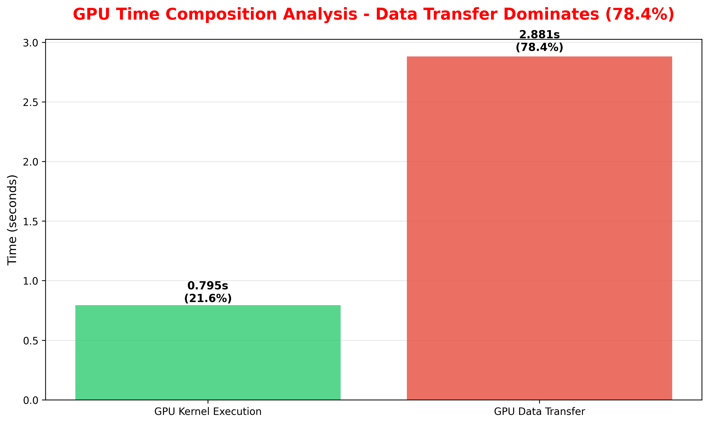
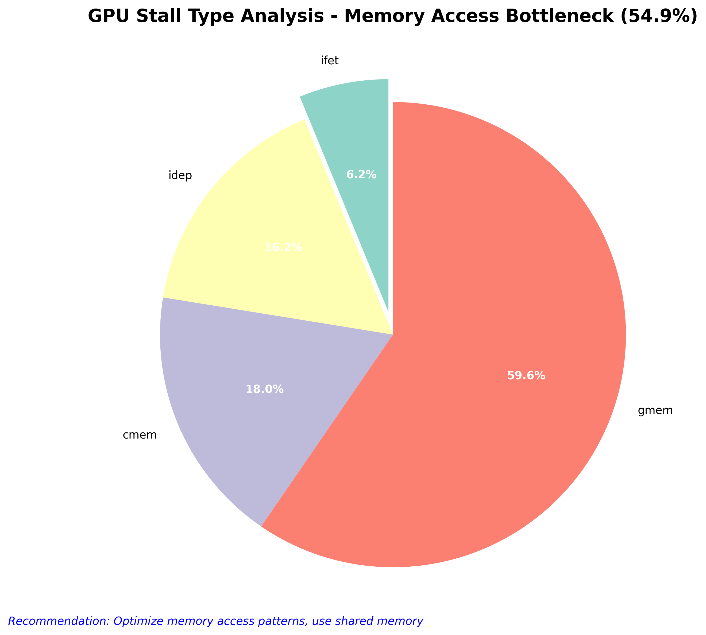
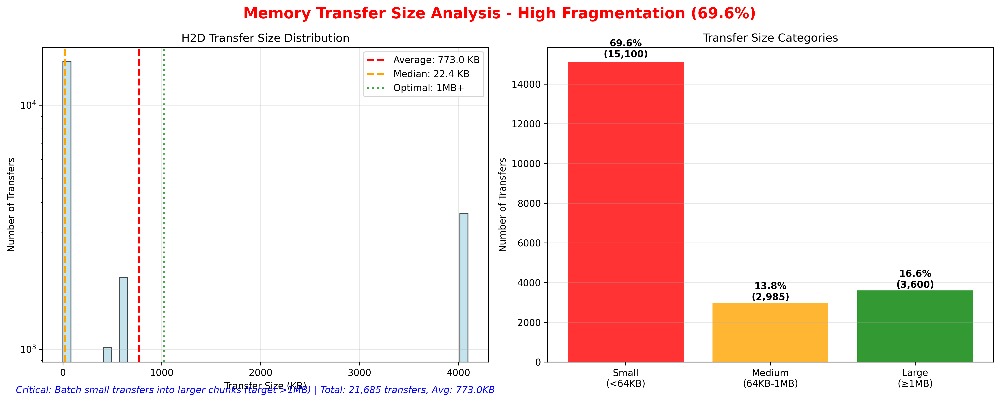
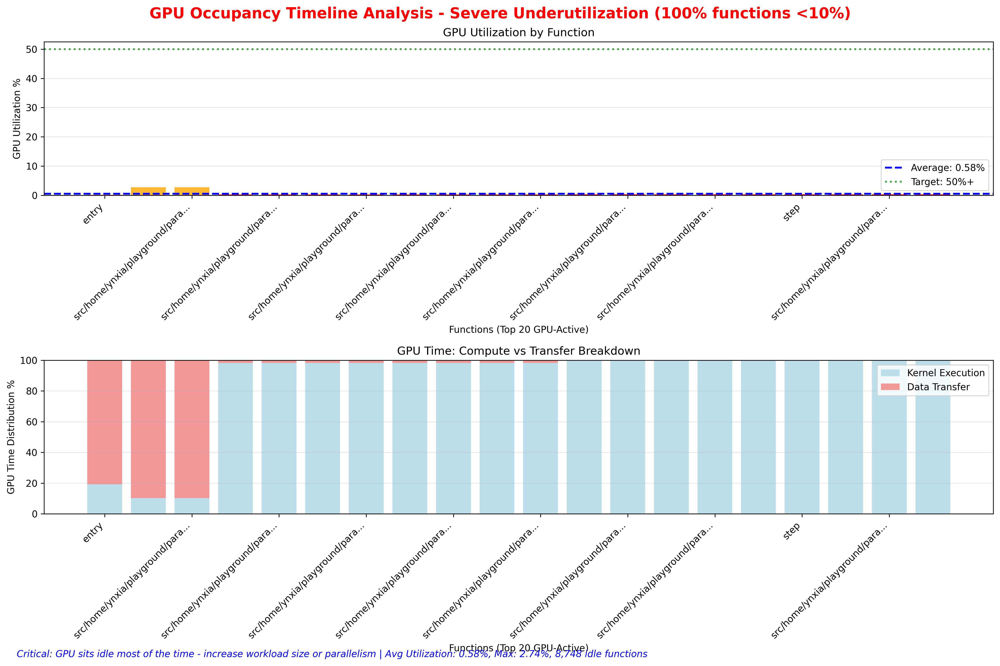

# DLRM GPU Performance Analysis Report

## Executive Summary

This report presents a comprehensive analysis of DLRM (Deep Learning Recommendation Model) GPU performance using HPCToolkit profiling data. The analysis focuses on identifying performance bottlenecks, GPU utilization patterns, and optimization opportunities through visual analytics.

## Analysis Overview

The performance analysis consists of two categories of charts:
- **Management Core Charts (1-4)**: High-level performance overview for decision-making
- **Additional Technical Charts (1-2)**: Detailed technical analysis for optimization

---

## Management Core Charts

### 1. CPU vs GPU Time Distribution

**Purpose**: Provides a high-level view of compute resource utilization between CPU and GPU components.

**What it shows**:
- Pie chart showing the proportion of time spent on CPU vs GPU operations
- GPU utilization percentage with color-coded status indicators
- Performance assessment based on GPU utilization thresholds

**Interpretation**:
- **Green (✅)**: GPU utilization >20% - reasonable performance
- **Orange (⚠️)**: GPU utilization 5-20% - needs optimization
- **Red (🚨)**: GPU utilization <5% - severe underutilization

**Key Insights**:
- Low GPU utilization indicates hardware underutilization and poor ROI
- High CPU dominance suggests workload imbalance or inadequate GPU acceleration
- Target: Achieve >50% GPU utilization for optimal performance

### 2. GPU Time Composition Analysis

**Purpose**: Breaks down GPU time into compute vs data transfer components to identify bottlenecks.

**What it shows**:
- Bar chart comparing GPU kernel execution time vs data transfer time
- Percentage breakdown of GPU time allocation
- Color-coded analysis based on data transfer overhead

**Interpretation**:
- **Blue/Green**: Compute-dominated (normal) - <30% transfer overhead
- **Orange**: High transfer overhead - 30-60% of GPU time
- **Red**: Transfer-dominated (problematic) - >60% of GPU time

**Key Insights**:
- High data transfer percentage indicates memory bandwidth bottleneck
- Compute-dominated workloads show healthy GPU utilization
- Transfer optimization should target unified memory and batching

### 3. GPU Stall Type Analysis

**Purpose**: Identifies specific GPU compute efficiency issues through stall type analysis.

**What it shows**:
- Pie chart showing distribution of different GPU stall types
- Dominant stall types with percentage breakdown
- Optimization recommendations based on stall patterns

**Interpretation**:
- **Memory-related stalls** (gmem): Optimize memory access patterns
- **Instruction dependency stalls** (idep): Increase parallelism
- **Synchronization stalls** (sync): Reduce barrier operations

**Key Insights**:
- Dominant stall types indicate specific optimization directions
- Memory stalls >40% suggest memory bandwidth or access pattern issues
- Instruction dependency stalls indicate insufficient parallelism

### 4. Kernel Launch Efficiency Analysis

**Purpose**: Evaluates kernel launch overhead and granularity efficiency.

**What it shows**:
- Left: Histogram of kernel execution time distribution
- Right: Efficiency analysis comparing compute time vs launch overhead
- Average kernel time and launch count statistics

**Interpretation**:
- **Green**: Launch overhead <15% - efficient kernel granularity
- **Orange**: Launch overhead 15-30% - consider optimization
- **Red**: Launch overhead >30% - severe inefficiency requiring kernel fusion

**Key Insights**:
- Many small kernels indicate fusion opportunities
- High launch overhead reduces effective compute utilization
- Target: Average kernel time >100μs for efficiency

---

## Additional Technical Charts

### 5. Memory Transfer Size Distribution

**Purpose**: Analyzes memory transfer patterns and bandwidth utilization efficiency.

**What it shows**:
- Left: Histogram of Host-to-Device (H2D) transfer size distribution
- Right: Transfer size categorization (Small <64KB, Medium 64KB-1MB, Large ≥1MB)
- Bandwidth utilization statistics and fragmentation analysis

**Interpretation**:
- **Small transfers** (<64KB): Inefficient, high overhead
- **Medium transfers** (64KB-1MB): Moderate efficiency
- **Large transfers** (≥1MB): Optimal bandwidth utilization

**Key Insights**:
- High percentage of small transfers indicates fragmentation
- Transfer batching can significantly improve bandwidth utilization
- Target: Minimize transfers <64KB through consolidation

### 6. GPU Occupancy Timeline

**Purpose**: Shows GPU utilization patterns across different functions over time.

**What it shows**:
- Top: GPU utilization percentage by function (timeline approximation)
- Bottom: Breakdown of GPU time between kernel execution and data transfer
- Function-level utilization patterns and idle time analysis

**Interpretation**:
- **Red bars**: Severely underutilized functions (<1% GPU usage)
- **Orange bars**: Low utilization (1-10% GPU usage)
- **Yellow bars**: Moderate utilization (10-50% GPU usage)
- **Green bars**: Good utilization (>50% GPU usage)

**Key Insights**:
- Functions with consistent low utilization indicate optimization opportunities
- High transfer-to-compute ratios suggest memory bandwidth issues
- Idle functions contribute to overall GPU underutilization

---

## Performance Optimization Recommendations

### Immediate Actions (1-2 weeks)
1. **Batch Data Transfers**: Consolidate small transfers into larger chunks (>1MB)
2. **Use Pinned Memory**: Improve transfer bandwidth efficiency
3. **Adjust Batch Size**: Increase GPU workload to improve utilization

### Medium-term Optimizations (1-2 months)
1. **Kernel Fusion**: Reduce launch overhead by combining small kernels
2. **Unified Memory**: Simplify memory management and reduce transfer overhead
3. **Async Execution**: Implement CPU-GPU parallelization

### Long-term Strategy (3-6 months)
1. **Algorithm Optimization**: Target dominant stall types identified in analysis
2. **Hardware Assessment**: Evaluate upgrade needs based on utilization data
3. **Automated Monitoring**: Integrate performance tracking into development workflow

---

## Technical Specifications

- **Analysis Tool**: HPCToolkit + Hatchet
- **Profiling Scope**: CPU + GPU unified performance profiling
- **Chart Generation**: Python matplotlib with automated analysis
- **Data Processing**: Pandas-based metric computation and visualization

---

## Conclusion

The performance analysis reveals specific optimization opportunities across multiple dimensions:

1. **GPU Utilization**: Current utilization patterns indicate hardware underutilization
2. **Memory Bandwidth**: Transfer patterns show significant optimization potential
3. **Kernel Efficiency**: Launch overhead and stall analysis provide clear optimization directions
4. **Workload Balance**: CPU-GPU distribution suggests rebalancing opportunities

Implementing the recommended optimizations in priority order should yield significant performance improvements and better hardware ROI.

---

*Report generated by DLRM GPU Performance Analysis Tool* 